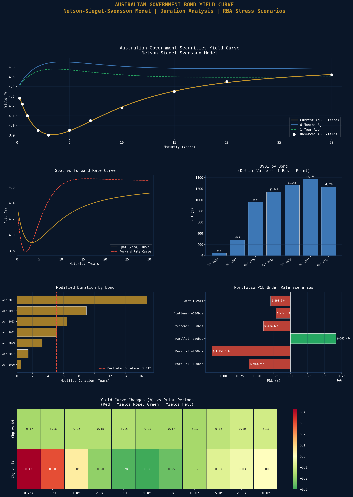

# Australian Government Bond Yield Curve & Duration Analysis

A fixed income analytics engine that constructs the Australian Government Securities (AGS) yield curve using the Nelson-Siegel-Svensson model, bootstraps zero-coupon rates, and performs full duration and stress-test analysis on a hypothetical AGS bond portfolio.

## Current AGS Yield Curve
| Tenor | Par Yield | Zero Rate |
|---|---|---|
| 0.25Y | 4.280% | 4.280% |
| 0.50Y | 4.220% | 4.220% |
| 1.00Y | 4.100% | 4.100% |
| 2.00Y | 3.950% | 3.976% |
| 3.00Y | 3.900% | 3.927% |
| 5.00Y | 3.950% | 4.053% |
| 7.00Y | 4.050% | 4.174% |
| 10.00Y | 4.180% | 4.424% |
| 15.00Y | 4.350% | 4.883% |
| 20.00Y | 4.450% | 5.007% |
| 30.00Y | 4.520% | 6.190% |

**Curve Shape:** Inverted at the short end (4.28% at 3M vs 3.90% at 3Y) then re-steepening at longer maturities - consistent with RBA rate cut expectations priced into the front end.

## Nelson-Siegel-Svensson Model Parameters
| Parameter | Value |
|---|---|
| Beta0 (Level) | 4.6832 |
| Beta1 (Slope) | -0.3058 |
| Beta2 (Curvature) | -4.3169 |
| Tau1 | 2.7410 |
| Tau2 | 3.3714 |

## Portfolio Risk Metrics
| Metric | Value |
|---|---|
| Total Market Value | $12,381,700 |
| Modified Duration | 5.11 years |
| Macaulay Duration | 5.21 years |
| Portfolio DV01 | $6,325 |
| Portfolio Convexity | 53.03 |

## RBA Rate Shock Stress Tests
| Scenario | P&L | Return |
|---|---|---|
| Parallel +100bps | -$602,747 | -4.87% |
| Parallel +200bps | -$1,151,566 | -9.30% |
| Parallel -100bps | +$665,474 | +5.37% |
| Steepener +100bps | -$396,426 | -3.20% |
| Flattener +100bps | -$212,788 | -1.72% |
| Twist (Bear) | -$291,384 | -2.35% |

**Key Insight:** The portfolio loses $6,325 for every 1 basis point rise in yields (DV01). A full RBA +100bps hiking cycle would cost approximately $602,747 on this $12.4M portfolio, demonstrating the critical importance of duration management in a rising rate environment.

## Visualisations

## Tools & Libraries
- Python 3
- pandas / numpy
- scipy (NSS optimisation)
- matplotlib / seaborn
- yfinance

## Files
- `Project_4_AGS_Yield_Curve.ipynb` - Full Colab notebook
- `asx_yield_curve.png` - Yield curve dashboard

## Key Concepts Demonstrated
- Zero-coupon rate bootstrapping from par yields
- Nelson-Siegel-Svensson model fitting via L-BFGS-B optimisation
- Modified duration, Macaulay duration, DV01, and convexity
- Spot vs forward rate curve derivation
- Parallel, steepener, flattener, and twist rate shock scenarios
- Portfolio-level risk aggregation

## Relevance to Australian Finance Industry
Australian fixed income managers including QIC, PIMCO Australia, and Pendal use Nelson-Siegel-Svensson curve models daily. The RBA and Australian Office of Financial Management (AOFM) use similar tools for debt management and AGS issuance strategy. Big Four bank treasury teams manage duration books using DV01 limits identical to those modelled here.
